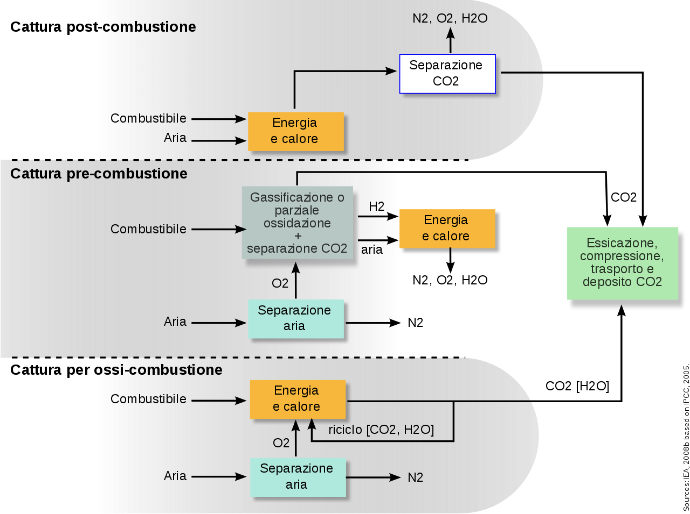

#### [Home](index.md)
# CCUS

## Che cos'è la CCUS?

Con l'acronimo CCUS (Carbon Capture, Utilisation and Storage) si intende la **cattura utilizzo e stoccaggio della CO2**.

Rappresenta in generale una tecnologia in via di sviluppo per far fronte alla crescente concentrazione della CO2 in atmosfera, un gas ad effetto serra che concorre al riscaldamento globale.

Esistono sostanzialmente tre tipologie diverse per la cattura del diossido di carbonio a livello industriale:

1. **Post Combustione**: la CO2 in questo caso viene catturata da dei flussi di combustione terminati venendo assorbita in adatti solventi chimici. La CO2 viene succcessivamente separata dal solvente e compressa per essere trasportata in siti di stoccaggio. Altri modi di separazione post-combustione sono per filtrazione o separazione criogenica.
2. **Pre Combustione**: il combustibile viene convertito prima della combustione in una mistura di idrogeno e anidride carbonica usando un processo chiamato *glassificazione*. La CO2 può essere poi trasportata e stoccata mentre l'idrogeno, miscelato con l'aria, può essere utilizzato come combustibile per la produzione di elettricità  o eventualmente per alimentare vetture ad idrogeno. 
3. **Ossicombustione** o **Combustione in Ossigeno**: questo processo prevede l'utilizzo di ossigeno puro in camera di combustione. Questo tipo di combustione produce principalmente vapore e anidride carbonica concentrata, più semplice da trattare e inviare allo stoccaggio.

A questi si affiancano sistemi di cattura e sequestro dell'anidride carbonica presente in ambiente, note come Carbon Dioxide Removal (CDR):

1. Rimboschimento per creare dei carbon sink, che eventualmente possono andare ad essere utilizzati per generare biocombustibili sui quali applicare le precedenti tecniche di sequestro in una configurazione nota come Bio-energy with carbon capture and storage (BECCS).
2. Cattura atmosferica (Direct Air Capture, DAC) tramite filtrazione o processi di scrubbing dell'aria con appositi solventi.
3. Sequestro nei suoli aumentando, con idonee tecniche agronomiche e colturali, il contenuto in composti organici nella rizosfera.

## Problematiche
I rischi connessi alla possibilità di confinamento della CO2 sono principalmente di due ordini:
1. il rilascio imprevisto di massicci quantitativi di CO2 in seguito ad eventi geologici o altre modificazioni delle strutture di contenimento;
2. una graduale e silente fuoriuscita in atmosfera prolungata nel tempo.

L'Intergorvenmental Panel on Climate Change (IPCC), suffragato anche dalle attuali applicazioni di confinamento della CO2, ritiene che le profondità geologiche previste per i futuri siti in progetto, accuratamente selezionati, rendano molto improbabile la possibilità di insuccesso. Si parla del 99% della CO2 trattenuta nel deposito nei primi 1000 anni. Rimane comunque attualmente dibattuta la capacità di questo sistema di trattenere la CO2 per tempi lunghissimi.
