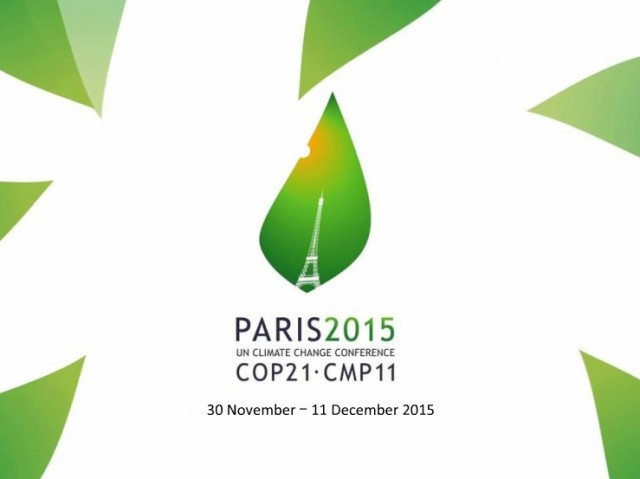

#### [Home](index.md)
## Accordi Internazionali: COP per tappe - la strada percorsa fino ad oggi
Era il **1995** l’anno in cui si tenne la prima Conferenza delle parti della **Convezione Onu sul climate change (UNFCCC)**, il primo trattato ambientale internazionale ad occuparsi del riscaldamento globale.

Da allora, oggi i vertici dell’UNFCCC hanno scritto la storia della lotta al climate change, tra successi e fallimenti.

### 1995 - COP 1 di Berlino
La Conferenza delle Parti dell'UNFCCC si incontrò per la prima volta a Berlino dal 28 marzo al 7 aprile 1995, ed espresse timori sull'adeguatezza delle azioni degli stati ad adempiere gli obblighi della Convenzione. Questi furono espressi in una dichiarazione ministeriale delle Nazioni Unite conosciuta come il "Mandato di Berlino", che stabiliva una fase di analisi e ricerca di due anni, per negoziare un "insieme completo di azioni" da cui gli Stati potessero scegliere quelle più adeguate per ognuno di essi, in modo che fossero le migliori dal punto di vista economico e ambientale.

### 1997 - COP 3 di Kyoto
Dopo due anni e mezzo di intense negoziazioni arriva la prima e vera svolta: il **Protocollo di Kyoto**, il primo trattato al mondo di riduezione delle emissioni di gas ad effetto serra. Gli Stati Uniti si rifiutarono tassativamente di ratificare l'atto che stabiliva *impegni di riduzione delle emissioni per i soli Paesi Sviluppati*. Gli impegni prevedono una prima fase di riduzione delle emissioni relativamente al periodo 2008-2012 rispetto ai livelli del 1990. Nel 2011 il Canada ad un solo anno dal termine ultimo, esce dal Protocollo.

### 2009 - COP 15 di Copenhagen
Le aspettative che negli anni avevano caricato il processo negoziale, trovano un muro invalicabile al vertice ONU in Danimarca. L'obiettivo era quello di stabilire un ambizioso accordo globale sul clima per il periodo dal 2012, anche se l'**accordo di Copenhagen** rimandava il compito al 2015. 
Il testo finale introduce per la prima volta in maniera ufficiale la necessità di **evitare il superamento della soglia dei 2 °C** nell'aumento della temperatura del pianeta.

Nonostante ciò, questo accordo non risultava vincolante e nemmeno operativo; per questo motivo il COP di Copenhagen risultò un fallimento completo.

### 2010 - COP 16 di Cancun
I Governi firmatari stabiliscono che bisognerà **tagliare le emissioni di gas serra dal 20% al 40% al 2020**.  Raggiunto un importante successo *simbolico*.

### 2012 - COP 18 di Doha
La 18° sessione negoziale della Conferenza riesce ad assicurare una seconda stagione al Protocollo di Kyoto (in scadenza lo stesso anno) estendendolo fino al 2020; stagione da cui tuttavia si defila la maggior parte dei paesi industrializzati. Alla fine, ad accettare il Kyoto bis sono unicamente Unione Europea, Australia, Svizzera e Norvegia, responsabili insieme solo del 15-20 per cento delle emissioni di gas serra.

### 2015 - COP di Parigi
La ventunesima Conferenza delle Parti di Parigi porta a casa il primo grande risultato, ossia **un patto climatico globale e condiviso**. L’obiettivo inderogabile è quello di mantenere l’aumento della temperatura ***«ben al di sotto dei 2 °C»***, con la raccomandazione a fare di più (per uno scenario sotto 1,5 ° C). Una delle disposizioni chiave dell’accordo è la creazione di un **meccanismo di revisione per gli impegni** dei vari paesi: avrà luogo ogni cinque anni, nell’ottica di aumentarne progressivamente l’ambizione, ma per ora nessuna data d’inizio è stata fissata.

