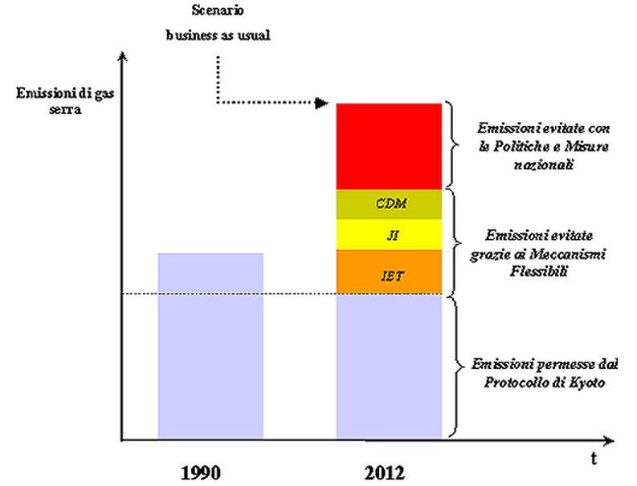

#### [Home](index.md)
## Accordi Internazionali: COP per tappe - la strada percorsa fino ad oggi
Era il **1995** l’anno in cui si tenne la prima Conferenza delle parti della **Convezione Onu sul climate change (UNFCCC)**, il primo trattato ambientale internazionale ad occuparsi del riscaldamento globale.

Da allora, oggi i vertici dell’UNFCCC hanno scritto la storia della lotta al climate change, tra successi e fallimenti.

### 1995 - COP 1 di Berlino
La Conferenza delle Parti dell'UNFCCC si incontrò per la prima volta a Berlino dal 28 marzo al 7 aprile 1995, ed espresse timori sull'adeguatezza delle azioni degli stati ad adempiere gli obblighi della Convenzione. Questi furono espressi in una dichiarazione ministeriale delle Nazioni Unite conosciuta come il "Mandato di Berlino", che stabiliva una fase di analisi e ricerca di due anni, per negoziare un "insieme completo di azioni" da cui gli Stati potessero scegliere quelle più adeguate per ognuno di essi, in modo che fossero le migliori dal punto di vista economico e ambientale.

### 1997 - COP 3 di Kyoto
Dopo due anni e mezzo di intense negoziazioni arriva la prima e vera svolta: il **Protocollo di Kyoto**, il primo trattato al mondo di riduezione delle emissioni di gas ad effetto serra. Gli Stati Uniti si rifiutarono tassativamente di ratificare l'atto che stabiliva *impegni di riduzione delle emissioni per i soli Paesi Sviluppati*. Gli impegni prevedono una prima fase di riduzione delle emissioni relativamente al periodo 2008-2012 rispetto ai livelli del 1990. Nel 2011 il Canada ad un solo anno dal termine ultimo, esce dal Protocollo.

